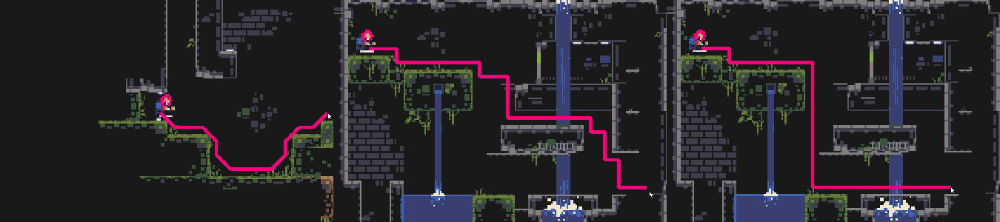

# wren-astar

A generic implementation of A* pathfinding in the Wren programming language - https://wren.io

Shown below: different heuristics + neighbors + costs



## Usage

The basic usage is `import "astar" for Astar`, and call `Astar.path2D`.
For details about the pathfinding and things like costs, heuristics and implementation
details, please see https://www.redblobgames.com/pathfinding/a-star/introduction.html

### Requirements
For now, it's required that the nodes you pass to this respond to `.x` and `.y` for the `path2D` function.
That's true for `start`, `end`, and values returned from `neighbors_get_fn`.
Basically, any class is valid, provided it has these getters. An example class is shown below.

Coordinates must be within 16 bit range (negative or positive), as in `−32,768  => 32,767` or `0 => 65,535`.

```js
class Node {
  x { _x }
  y { _y }
  construct new(x, y) {
    _x = x
    _y = y
  }
}
```

### Astar.path2D

Returns a path between `start` and `end` if one was found, or `null` otherwise.
The path is a `List` of nodes received from `start`, `end` or `neighbors_get_fn` and are unmodified.

**Note**: Check if `start`/`end` are walkable before calling this function.

```js
get_path(start, end) {
  if(!is_walkable(start)) return null
  if(!is_walkable(end)) return null
  return AStar.path2D(start, end, _cost_get_fn, _neighbors_get_fn, _heuristic_fn)
}
```

> `start`   

A node with an `.x` and `.y` getter that is the beginning of the path.

> `end`   

A node with an `.x` and `.y` getter that is the goal for the path.

> `cost_get_fn`   

A function you provide that returns the traversal cost for a node given to the function.
This function passes a `from` node and a `to` node. if you don't have a cost, return 1.
```js
//no cost?
_cost_get_fn = Fn.new {|from, to| 1 }
//cost from a tilemap, simple (fake) example
_cost_get_fn = Fn.new {|from, to| tiles.get_cost(to.x, to.y) }
```

> `neighbors_get_fn`   

A function you provide that returns a list of the neighbors for a given node, as a node with an `.x` and `.y` getter.
This function can decide whether diagonals are included or not.
```js
_neighbors_get_fn = Fn.new {|node|
  var list = []
  //check above, below, left and right.
  if(is_walkable(node.x, node.y+1)) list.add(Node.new(node.x, node.y+1))
  if(is_walkable(node.x, node.y-1)) list.add(Node.new(node.x, node.y-1))
  if(is_walkable(node.x+1, node.y)) list.add(Node.new(node.x+1, node.y))
  if(is_walkable(node.x-1, node.y)) list.add(Node.new(node.x-1, node.y))
  return list
}
```

> `heuristic_fn`   

A function you provide that returns a heuristic value for a given point (in relation to the goal/end of the path).
```js
_heuristic_fn = Fn.new {|end, point|
  var manhattan = ((end.x - point.x).abs + (end.y - point.y).abs)
  return manhattan * 1.001 //fudge factor, see the linked articles on pathfinding
}
```

### Astar.MAX

A value that defaults to `250`, for the max number of iterations that will be considered valid. If the max is reached no path is returned.
To update it, use `Astar.MAX = 400`.